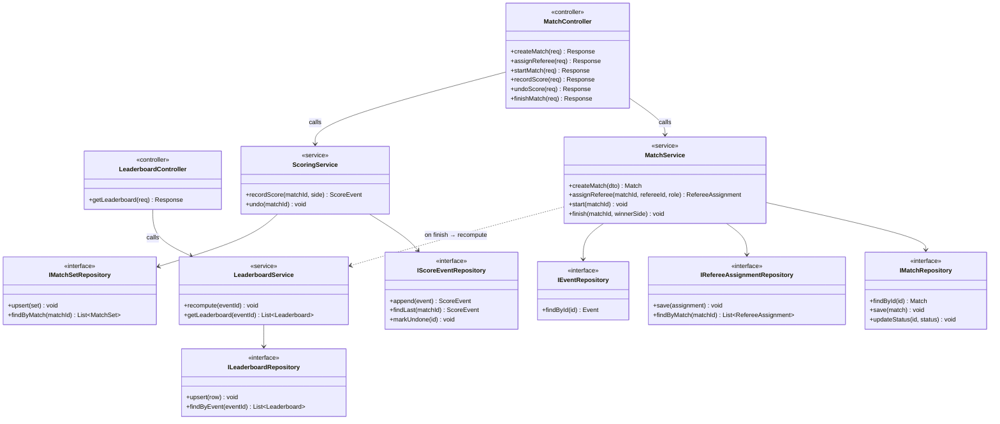

# Class Diagram — Tổ chức trận đấu & Xếp hạng (kiến trúc tương tác)

> Phạm vi: luồng nhập liệu **tổ chức trận đấu + chấm điểm + xếp hạng** (theo `erd_match_scoring.svg`, `MATCH_SCORING_FORMS.md`, `DATABASE_PLAN.md` M4).
> Đây **không** phải ERD. Mỗi lớp là một thành phần chạy trong hệ thống theo kiểu ảnh mẫu: **Controller → Service → IRepository «interface»**, có phương thức + chữ ký để thể hiện luồng tương tác.

## Sơ đồ (Mermaid)

> SVG bản vẽ tay (bố cục giống ảnh mẫu): `docs/class_diagram.svg`.

---

## 1. Thành phần (lớp)

| Lớp | Stereotype | Vai trò trong luồng |
|---|---|---|
| `MatchController` | `«controller»` | Cổng vào: tạo trận, phân công TT, bắt đầu, ghi điểm, undo, kết thúc |
| `LeaderboardController` | `«controller»` | Trả bảng xếp hạng |
| `MatchService` | `«service»` | Vòng đời trận: tạo → gán TT → start → finish; kích hoạt recompute khi kết thúc |
| `ScoringService` | `«service»` | Ghi điểm + Undo (ghi `score_events`, cập nhật `match_sets`) |
| `LeaderboardService` | `«service»` | Tính lại + đọc bảng xếp hạng |
| `IMatchRepository` | `«interface»` | Truy xuất/ghi `matches` |
| `IScoreEventRepository` | `«interface»` | Append/tìm/đánh dấu undo `score_events` |
| `IMatchSetRepository` | `«interface»` | Upsert/đọc `match_sets` |
| `IRefereeAssignmentRepository` | `«interface»` | Lưu/đọc phân công trọng tài |
| `IEventRepository` | `«interface»` | Đọc `events` (lấy `max_sets`, `points_per_set`) |
| `ILeaderboardRepository` | `«interface»` | Upsert/đọc `leaderboards` |

## 2. Phương thức từng lớp

- **MatchController** — `createMatch`, `assignReferee`, `startMatch`, `recordScore`, `undoScore`, `finishMatch` (mỗi cái `(req) → Response`).
- **LeaderboardController** — `getLeaderboard(req) → Response`.
- **MatchService** — `createMatch(dto) → Match`, `assignReferee(matchId, refereeId, role) → RefereeAssignment`, `start(matchId)`, `finish(matchId, winnerSide)`.
- **ScoringService** — `recordScore(matchId, side) → ScoreEvent`, `undo(matchId)`.
- **LeaderboardService** — `recompute(eventId)`, `getLeaderboard(eventId) → List<Leaderboard>`.
- **Repository «interface»** — chỉ khai báo hợp đồng truy cập dữ liệu; hiện cài đặt cụ thể là module gọi `query()` trong `config/db.js` (sẽ tách thành class repo khi cần).

## 3. Liên kết (luồng tương tác)

- `MatchController → MatchService` / `MatchController → ScoringService` — định tuyến lệnh tổ chức + chấm điểm.
- `LeaderboardController → LeaderboardService` — đọc BXH.
- `MatchService → IMatchRepository / IRefereeAssignmentRepository / IEventRepository` — đọc luật event, ghi trận + phân công.
- `ScoringService → IScoreEventRepository / IMatchSetRepository` — ghi sự kiện điểm, cập nhật ván.
- `LeaderboardService → ILeaderboardRepository` — ghi/đọc xếp hạng.
- `MatchService ⇢ LeaderboardService` (**on finish → recompute**) — kết thúc trận kích hoạt tính lại BXH.

Luồng tổng: **tạo trận → phân công TT → start → ghi điểm (lặp) → undo (tuỳ) → finish → recompute BXH** — bám đúng `MATCH_SCORING_FORMS.md` mục 8.
