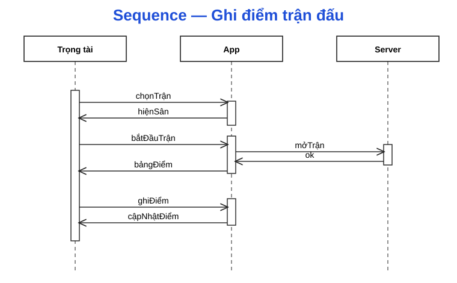
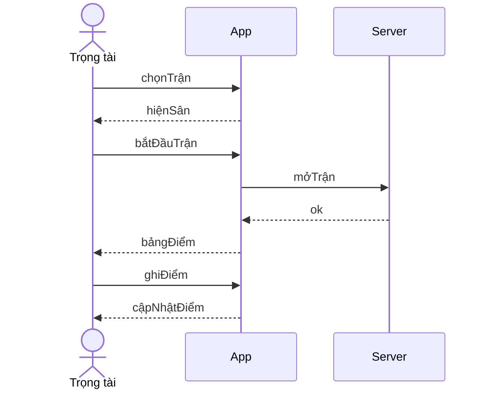
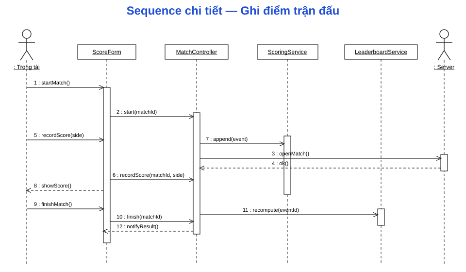
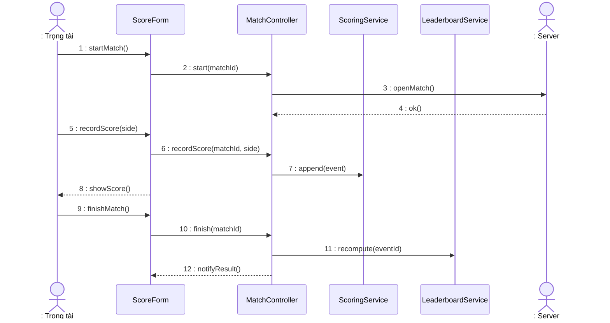

# Sequence Diagram — Ghi điểm trận đấu (luồng chấm điểm + xếp hạng)

> Phạm vi: luồng **bắt đầu trận → ghi điểm → kết thúc → tính lại BXH** (theo `MATCH_SCORING_FORMS.md`, `CLASS_DIAGRAM.md`).
> Mẫu trình bày bám đúng "Ví dụ 1": (1) sơ đồ tuần tự mức cao, (2) sơ đồ tuần tự chi tiết có đánh số thông điệp, (3) bảng phân loại tương tác.

---

## 1. Sơ đồ tuần tự — mức cao (Ví dụ 1)

Ba đối tượng khái niệm: **Trọng tài → App → Server** (tương tự User → ATM → Bank).

---

## 2. Sơ đồ tuần tự — chi tiết (Ví dụ 1 tt)

Thêm các **boundary/control/entity**: `ScoreForm` (UI) · `MatchController` · `ScoringService` · `LeaderboardService`, hai actor hai đầu: `:Trọng tài` và `:Server`.

---

## 3. Bảng phân loại tương tác (Ví dụ 1 tt)

| Tương tác | Đối tượng | Loại |
|---|---|---|
| startMatch | ScoreForm | UI |
| start | MatchController | Domain |
| openMatch | MatchController | Domain |
| ok | Server | System |
| recordScore | ScoreForm | UI |
| recordScore | MatchController | Domain |
| append | ScoringService | Domain |
| showScore | ScoreForm | UI |
| finishMatch | ScoreForm | UI |
| finish | MatchController | Domain |
| recompute | LeaderboardService | Domain |
| notifyResult | ScoreForm | UI |

> **Loại:** `UI` = boundary (form người dùng) · `Domain` = control/service nghiệp vụ · `System` = tác nhân ngoài (Server/DB).
